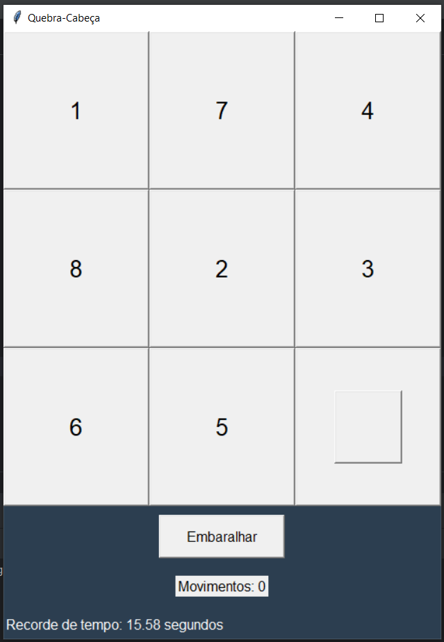

  

# Quebra Cabeça Numéro
Este código Python implementa um jogo de quebra-cabeça numérico em uma interface gráfica usando a biblioteca Tkinter. O objetivo do jogo é organizar os números em ordem numérica correta deslizando os espaços vazios.

Funcionalidades do Jogo:

- Interface Gráfica:

A interface é uma janela que contém uma grade de botões numerados e um botão "Embaralhar".
Os botões podem ser clicados para mover os números.

- Embaralhamento do Quebra-Cabeça:

O botão "Embaralhar" randomiza a ordem dos números.
Garante que o quebra-cabeça seja sempre solucionável.
Mecânica de Movimentação:

O jogador pode clicar em um número adjacente ao espaço vazio para movê-lo.

- Contagem de Movimentos:

O número de movimentos é registrado e exibido na interface.
Verificação de Resolução:

O jogo verifica se o quebra-cabeça foi resolvido corretamente.

- Feedback de Conclusão:

Quando o jogo é resolvido, uma mensagem de parabéns é exibida, mostrando o número de movimentos e tempo gasto.

- Coleta de Dados:

Após cada jogo, o código grava os resultados (número de movimentos e tempo) em um arquivo CSV chamado game_results.csv.

- Geração de Informações Adicionais:

Além de mostrar a mensagem de parabéns, o código também calcula e imprime 

- Informações adicionais:
A média de movimentos e tempo de todos os jogos registrados até o momento.

- Objetivo do Jogo:

O objetivo do jogo é reorganizar os números em ordem crescente, utilizando a menor quantidade de movimentos e o menor tempo possível.

Nota Importante:
Para manter o histórico de resultados, é necessário que o arquivo game_results.csv esteja no mesmo diretório que o código. Este arquivo será criado automaticamente durante a execução do programa e irá armazenar os resultados de todos os jogos realizados.
